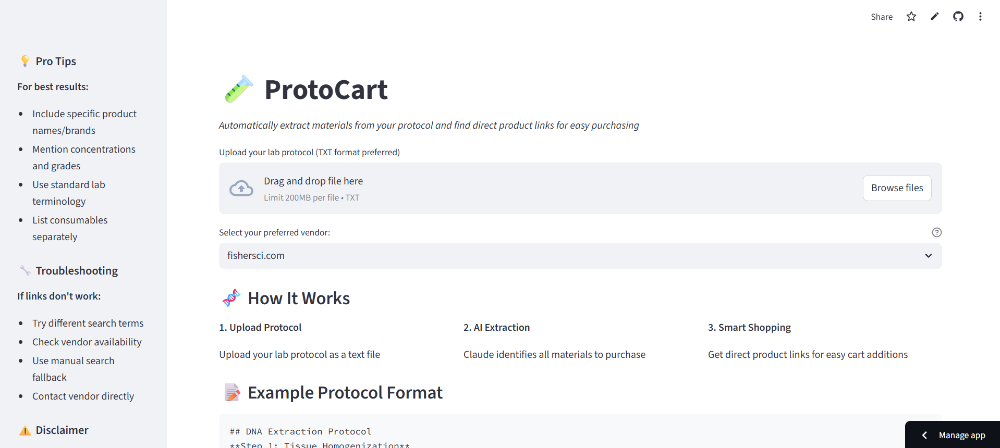

[](LICENSE)
# 🧪 ProtoCart — Protocol-to-Shopping List Agent


**ProtoCart** helps researchers identify materials mentioned in lab protocols and organize them into a smart shopping list. Upload your protocol, and the app will extract reagents and consumables, then find direct product links from vendors like FisherSci, Sigma-Aldrich, and ThermoFisher..  

[](https://protocart.streamlit.app/)
---

## 🚀 Features

-  **AI-powered parsing** using Anthropic Claude
-  **Direct product links** from top lab vendors
-  **Shopping checklist** with tracking and export to CSV
-  **Custom search** using catalog hints and specifications
-  **Support for multiple vendors**: FisherSci, Sigma-Aldrich, ThermoFisher
-  Example protocols and user guidance included

---

---

## 📂 How to Use

1. Go to [protocart.streamlit.app](https://protocart.streamlit.app/)
2. Upload a `.txt` protocol file
3. Choose a preferred vendor (e.g., `fishersci.com`)
4. Click "🔍 Find Products"
5. Browse links, check items added to cart, and download the list

---

## 🧰 Tech Stack

- [Streamlit](https://streamlit.io/)
- [Anthropic Claude 3.5 API](https://www.anthropic.com/)
- [BeautifulSoup4](https://pypi.org/project/beautifulsoup4/)
- [Requests](https://docs.python-requests.org/)
- [Pandas](https://pandas.pydata.org/)

---

## 📦 Installation (Local)

```bash
git clone https://github.com/shanptom/lba.git
cd protocart
pip install -r requirements.txt
streamlit run app.py
```
---
## Adding Claude API

To use Claude, create a file named .streamlit/secrets.toml and add your API key:
Create `.streamlit/secrets.toml` then add api key as follows in `secrets.toml` file.

```
ANTHROPIC_API_KEY = "your_claude_api_key"
```
⚠️ Do not commit this file to GitHub.

---
## 📜 License
This project is licensed under the MIT License. 
